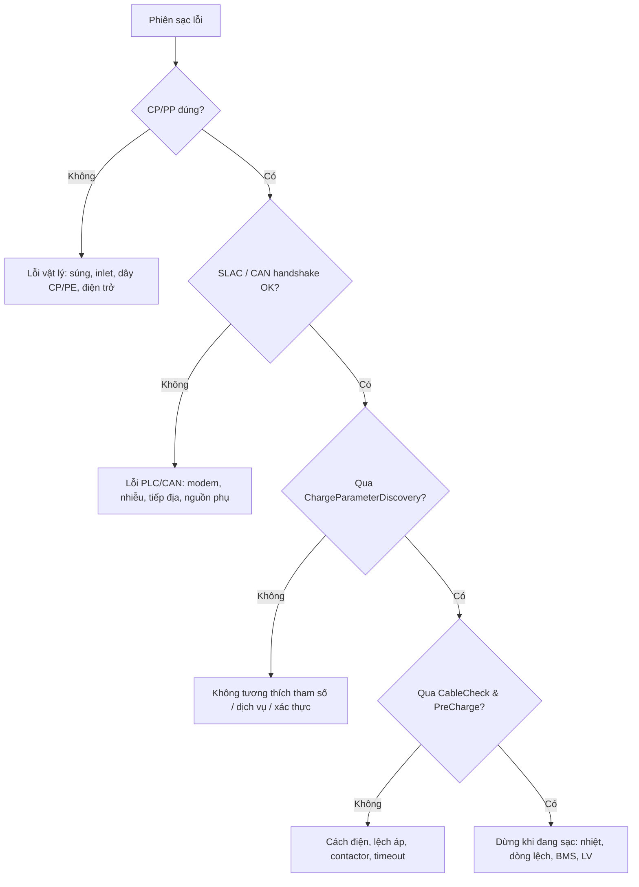

# 6. Chẩn đoán lỗi (Diagnostics)

Cách tiếp cận: **xác định phiên sạc dừng ở pha nào**, rồi khoanh vùng theo pha đó.

```mermaid
flowchart TB
    S[Phiên sạc lỗi] --> Q1{CP/PP đúng?}
    Q1 -- Không --> F1[Lỗi vật lý: súng, inlet, dây CP/PE, điện trở]
    Q1 -- Có --> Q2{SLAC / CAN handshake OK?}
    Q2 -- Không --> F2[Lỗi PLC/CAN: modem, nhiễu, tiếp địa, nguồn phụ]
    Q2 -- Có --> Q3{Qua ChargeParameterDiscovery?}
    Q3 -- Không --> F3[Không tương thích tham số / dịch vụ / xác thực]
    Q3 -- Có --> Q4{Qua CableCheck & PreCharge?}
    Q4 -- Không --> F4[Cách điện, lệch áp, contactor, timeout]
    Q4 -- Có --> F5[Dừng khi đang sạc: nhiệt, dòng lệch, BMS, LV]
```

- [Lỗi thường gặp](loi-thuong-gap.md)
- [Công cụ](cong-cu.md)
